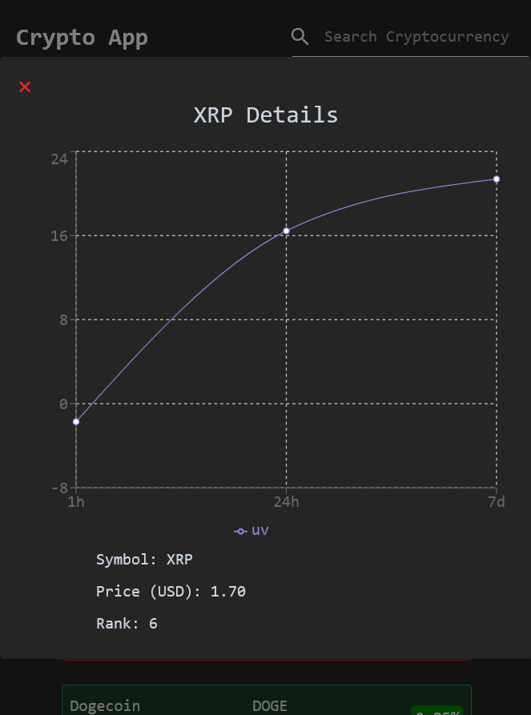
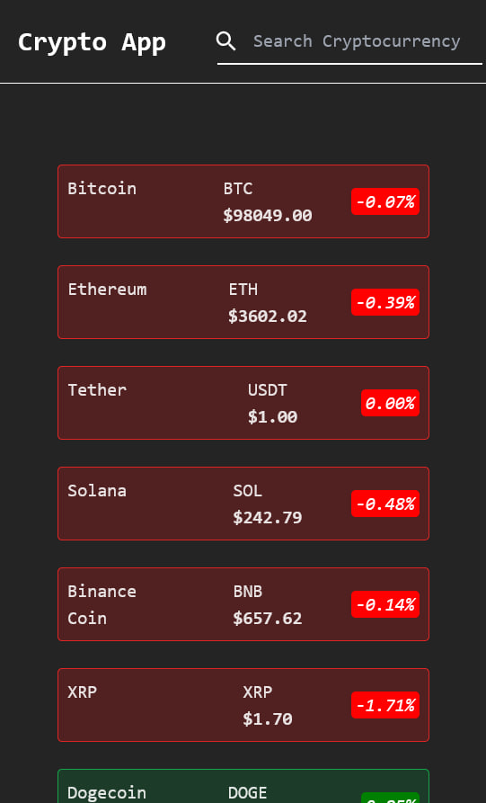
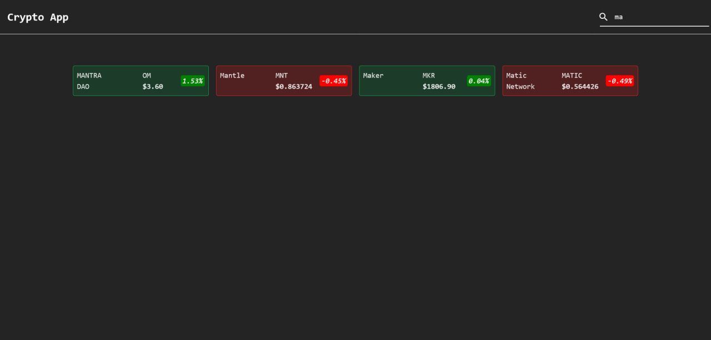
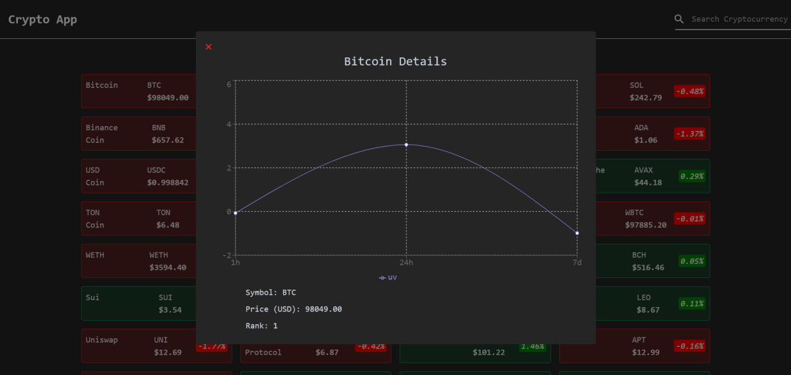
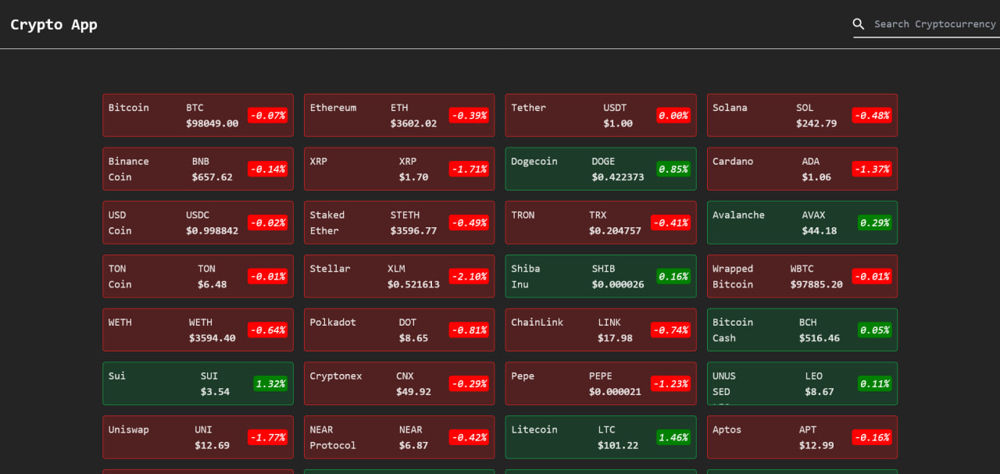

# Crypto App

Crypto App is a simple React application that displays information about cryptocurrencies. Users can search for specific cryptocurrencies and view details about each coin, including a price chart.







## Table of Contents

- [Getting Started](#getting-started)
  - [Prerequisites](#prerequisites)
  - [Installation](#installation)
- [Usage](#usage)
- [Components](#components)
- [Libraries Used](#libraries-used)

## Getting Started

### Prerequisites

Make sure you have Node.js and npm installed on your machine.

- Node.js: [https://nodejs.org/](https://nodejs.org/)
- npm: [https://www.npmjs.com/](https://www.npmjs.com/)

### Installation

1. Clone the repository:

```bash
git clone https://github.com/r-o-z-a/cryptocurrencyapp-reactjs-tailwindcss.git
cd crypto-app
```

2. Install dependencies:

```bash
npm install
```

3. Start the development server:

```bash
npm run dev
```

The app will be available at [http://localhost:3000](http://localhost:3000).

## Usage

- Open your web browser and navigate to [http://localhost:3000](http://localhost:3000).
- Use the search bar to search for specific cryptocurrencies.
- Click on a coin to view more details, including a price chart.

## Components

The project consists of the following components:

- `App`: The main component that fetches cryptocurrency data and renders the list of coins.
- `Coin`: Represents an individual coin card.
- `Details`: Displays detailed information about a selected coin, including a price chart.
- `Navbar`: The navigation bar with a search functionality.

## Libraries Used

- React: [https://reactjs.org/](https://reactjs.org/)
- Axios: [https://axios-http.com/](https://axios-http.com/)
- Recharts: [http://recharts.org/](http://recharts.org/)
